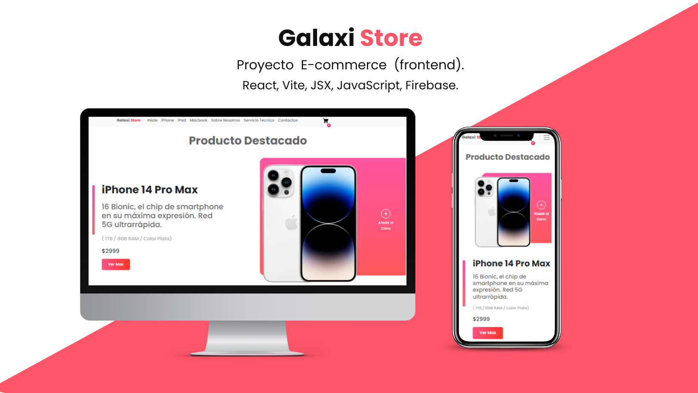

# Galaxi Store React Vite JSX E-commerce (Frontend)

## Introduccion

¿De qué trata?
Es un proyecto frontend de una aplicacion web (Web App) para un E-Commerce de venta de productos tecnologicos de la empresa Apple trabajado con React, Vite, JSX y Firebase. Este proyecto manejara las vistas gracias de react router dom permitiendome desarrollar una SPA (Single page application), todo los productos son traidos de una base de datos Firebase (Firestore) para ser consumidos y mostrados en pantallas. Su construcción comienza por mobile first.
Este proyecto seguirá en desarrollo mientras vaya aprendiendo nuevas tecnologías en el camino.

## Video del Funcionamiento

[Video Tutorial](https://drive.google.com/file/d/1UtXGyGh1hOyH1nUnNbwi0F1_b-H6SvDM/view?usp=sharing)

## Stack Tecnologico 

### Lenguales
1. HTML5
2. CSS3
3. JavaScript
4. JSX 

### Dependencias
1. Bootstrap : 5.2.3
2. Bootstrap-icons": 1.10.3
3. Firebase : 9.17.1
4. React : 18.2.0
5. React-bootstrap : 2.7.0
6. React-dom : 18.2.0
7. React-router-dom : 6.8.0
8. Vite : 4.0.0
9. React-toastify : 9.1.1

## Nota
Si te gusta este proyecto y deseas inspirarte en un E-Commerce similar, debes saber que a la hora de clonar el repositorio, la base de datos de donde trae los productos no va a funcionar, ya que oculte la carpeta **firebase** porque contiene informacion privada. Si necesitas mas informacion puedes contactarme en mi [Linkedin](https://www.linkedin.com/in/augusto-gutierrez/).